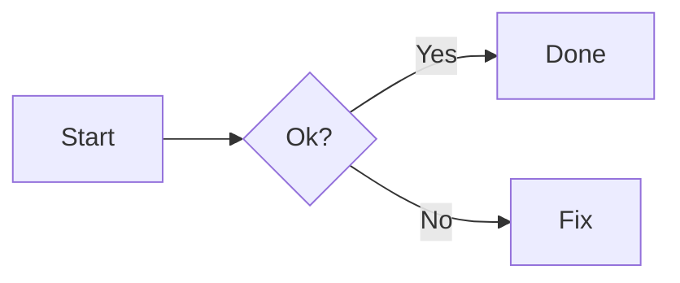
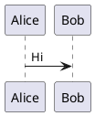

<!-- Parte 2/12 (revisada com imagens por URL) — Itens 121–240 -->

## Seção E — Tabelas (GFM) do básico ao “avançado” (121–175)

121) Tabela mínima

**Código:**
```md
| A | B |
|---|---|
| 1 | 2 |
```

**Resultado:**
| A | B |
|---|---|
| 1 | 2 |

---

122) Alinhar coluna à esquerda (padrão)

**Código:**
```md
| Nome | Valor |
|:-----|:------|
| a    | 1     |
```

**Resultado:**
| Nome | Valor |
|:-----|:------|
| a    | 1     |

---

123) Alinhar coluna ao centro

**Código:**
```md
| Nome | Valor |
|:----:|:-----:|
|  a   |   1   |
```

**Resultado:**
| Nome | Valor |
|:----:|:-----:|
|  a   |   1   |

---

124) Alinhar coluna à direita

**Código:**
```md
| Nome | Valor |
|-----:|------:|
| a    |     1 |
```

**Resultado:**
| Nome | Valor |
|-----:|------:|
| a    |     1 |

---

125) Misturar alinhamentos

**Código:**
```md
| Esquerda | Centro | Direita |
|:---------|:------:|--------:|
| a        | b      |       c |
```

**Resultado:**
| Esquerda | Centro | Direita |
|:---------|:------:|--------:|
| a        | b      |       c |

---

126) Tabela com código inline

**Código:**
```md
| Comando | Descrição |
|---|---|
| `npm i` | instala deps |
```

**Resultado:**
| Comando | Descrição |
|---|---|
| `npm i` | instala deps |

---

127) Tabela com bloco de código (tende a NÃO ficar bom no GitHub)

**Código:**
```md
| Exemplo |
|---|
| ```js
| console.log("x")
| ``` |
```

**Resultado:**
| Exemplo |
|---|
| ```js
| console.log("x")
| ``` |

---

128) Alternativa: tabela com `<pre><code>` (HTML)

**Código:**
```html
<table>
  <tr><th>Exemplo</th></tr>
  <tr><td><pre><code>console.log("x")</code></pre></td></tr>
</table>
```

**Resultado:**
<table>
  <tr><th>Exemplo</th></tr>
  <tr><td><pre><code>console.log("x")</code></pre></td></tr>
</table>

---

129) Tabela com links

**Código:**
```md
| Link | Tipo |
|---|---|
| [Docs](https://example.com) | externo |
| [GitHub](https://github.com) | externo |
```

**Resultado:**
| Link | Tipo |
|---|---|
| [Docs](https://example.com) | externo |
| [GitHub](https://github.com) | externo |

---

130) Tabela com imagem pequena (ícone por URL)

**Código:**
```md
| Status | Info |
|---|---|
|  | pronto |
```

**Resultado:**
| Status | Info |
|---|---|
|  | pronto |

---

131) Tabela como “layout” (cards simples)

**Código:**
```md
| Módulo | Descrição |
|---|---|
| **Core** | regras principais |
| **CLI** | interface de linha |
```

**Resultado:**
| Módulo | Descrição |
|---|---|
| **Core** | regras principais |
| **CLI** | interface de linha |

---

132) Tabela com múltiplas linhas (usando `<br>`)

**Código:**
```md
| Campo | Detalhe |
|---|---|
| Observação | Linha 1<br>Linha 2<br>Linha 3 |
```

**Resultado:**
| Campo | Detalhe |
|---|---|
| Observação | Linha 1<br>Linha 2<br>Linha 3 |

---

133) Cabeçalho com 3 colunas

**Código:**
```md
| A | B | C |
|---|---|---|
| 1 | 2 | 3 |
```

**Resultado:**
| A | B | C |
|---|---|---|
| 1 | 2 | 3 |

---

134) “Sem borda” não existe em Markdown; use HTML

**Código:**
```html
<table>
  <tr><td>A</td><td>B</td></tr>
  <tr><td>1</td><td>2</td></tr>
</table>
```

**Resultado:**
<table>
  <tr><td>A</td><td>B</td></tr>
  <tr><td>1</td><td>2</td></tr>
</table>

---

135) Tabela com `<thead>`/`<tbody>`

**Código:**
```html
<table>
  <thead>
    <tr><th>Col</th><th>Val</th></tr>
  </thead>
  <tbody>
    <tr><td>a</td><td>1</td></tr>
  </tbody>
</table>
```

**Resultado:**
<table>
  <thead>
    <tr><th>Col</th><th>Val</th></tr>
  </thead>
  <tbody>
    <tr><td>a</td><td>1</td></tr>
  </tbody>
</table>

---

136) Tabela com `colspan` (HTML)

**Código:**
```html
<table>
  <tr><th colspan="2">Título</th></tr>
  <tr><td>A</td><td>B</td></tr>
</table>
```

**Resultado:**
<table>
  <tr><th colspan="2">Título</th></tr>
  <tr><td>A</td><td>B</td></tr>
</table>

---

137) Tabela com `rowspan` (HTML)

**Código:**
```html
<table>
  <tr><td rowspan="2">Grupo</td><td>Item 1</td></tr>
  <tr><td>Item 2</td></tr>
</table>
```

**Resultado:**
<table>
  <tr><td rowspan="2">Grupo</td><td>Item 1</td></tr>
  <tr><td>Item 2</td></tr>
</table>

---

138) Tabela com alinhamento de célula (HTML)

**Código:**
```html
<table>
  <tr>
    <td align="left">Esq</td>
    <td align="center">Centro</td>
    <td align="right">Dir</td>
  </tr>
</table>
```

**Resultado:**
<table>
  <tr>
    <td align="left">Esq</td>
    <td align="center">Centro</td>
    <td align="right">Dir</td>
  </tr>
</table>

---

139) Tabela com largura (HTML; pode ser ignorado)

**Código:**
```html
<table>
  <tr>
    <td width="60%">Coluna larga</td>
    <td width="40%">Coluna menor</td>
  </tr>
</table>
```

**Resultado:**
<table>
  <tr>
    <td width="60%">Coluna larga</td>
    <td width="40%">Coluna menor</td>
  </tr>
</table>

---

140) Tabela com imagem + texto (agora com URL)

**Código:**
```html
<table>
  <tr>
    <td>
      
    </td>
    <td>
      <b>Projeto</b><br>
      Uma descrição curta aqui.
    </td>
  </tr>
</table>
```

**Resultado:**
<table>
  <tr>
    <td>
      
    </td>
    <td>
      <b>Projeto</b><br>
      Uma descrição curta aqui.
    </td>
  </tr>
</table>

---

141) “Card” com badge dentro da tabela

**Código:**
```md
| Projeto | Build |
|---|---|
| MeuApp |  |
```

**Resultado:**
| Projeto | Build |
|---|---|
| MeuApp |  |

---

142) Matriz de compatibilidade

**Código:**
```md
| OS | Suporte |
|---|---|
| Linux | ✅ |
| macOS | ✅ |
| Windows | ⚠️ |
```

**Resultado:**
| OS | Suporte |
|---|---|
| Linux | ✅ |
| macOS | ✅ |
| Windows | ⚠️ |

---

143) Tabela de features

**Código:**
```md
| Feature | Status |
|---|---|
| Login | ✅ |
| Pagamentos | 🚧 |
| Export | ❌ |
```

**Resultado:**
| Feature | Status |
|---|---|
| Login | ✅ |
| Pagamentos | 🚧 |
| Export | ❌ |

---

144) Tabela “estreita” (HTML)

**Código:**
```html
<table>
  <tr><th>Flag</th><th>Desc</th></tr>
  <tr><td><code>-h</code></td><td>ajuda</td></tr>
</table>
```

**Resultado:**
<table>
  <tr><th>Flag</th><th>Desc</th></tr>
  <tr><td><code>-h</code></td><td>ajuda</td></tr>
</table>

---

145) Tabela com âncoras internas (exemplo)

**Código:**
```md
| Seção | Ir |
|---|---|
| Instalação | [#](#instalação) |
| Uso | [#](#uso) |
```

**Resultado:**
| Seção | Ir |
|---|---|
| Instalação | [#](#instalação) |
| Uso | [#](#uso) |

---

146) Tabela com listas dentro (HTML)

**Código:**
```html
<table>
  <tr><th>Tarefas</th></tr>
  <tr>
    <td>
      <ul>
        <li>uma</li>
        <li>duas</li>
      </ul>
    </td>
  </tr>
</table>
```

**Resultado:**
<table>
  <tr><th>Tarefas</th></tr>
  <tr>
    <td>
      <ul>
        <li>uma</li>
        <li>duas</li>
      </ul>
    </td>
  </tr>
</table>

---

147) Tabela com `<details>` dentro

**Código:**
```html
<table>
  <tr>
    <td>
      <details>
        <summary>Detalhes</summary>
        Conteúdo escondido.
      </details>
    </td>
  </tr>
</table>
```

**Resultado:**
<table>
  <tr>
    <td>
      <details>
        <summary>Detalhes</summary>
        Conteúdo escondido.
      </details>
    </td>
  </tr>
</table>

---

148) Tabela com `<kbd>`

**Código:**
```md
| Atalho | Ação |
|---|---|
| <kbd>Ctrl</kbd>+<kbd>C</kbd> | copiar |
```

**Resultado:**
| Atalho | Ação |
|---|---|
| <kbd>Ctrl</kbd>+<kbd>C</kbd> | copiar |

---

149) Tabela com `<sub>` e `<sup>`

**Código:**
```md
| Símbolo | Exemplo |
|---|---|
| sub | H<sub>2</sub>O |
| sup | x<sup>2</sup> |
```

**Resultado:**
| Símbolo | Exemplo |
|---|---|
| sub | H<sub>2</sub>O |
| sup | x<sup>2</sup> |

---

150) Roadmap

**Código:**
```md
| Versão | Meta |
|---|---|
| 1.0 | MVP |
| 1.1 | Performance |
| 2.0 | Plugins |
```

**Resultado:**
| Versão | Meta |
|---|---|
| 1.0 | MVP |
| 1.1 | Performance |
| 2.0 | Plugins |

---

151) Changelog compacto

**Código:**
```md
| Data | Mudança |
|---|---|
| 2026-03-15 | docs |
```

**Resultado:**
| Data | Mudança |
|---|---|
| 2026-03-15 | docs |

---

152) Texto longo em tabela

**Código:**
```md
| Campo | Texto |
|---|---|
| Nota | Um texto bem longo que quebra em várias linhas naturalmente. |
```

**Resultado:**
| Campo | Texto |
|---|---|
| Nota | Um texto bem longo que quebra em várias linhas naturalmente. |

---

153) Tabela com `<blockquote>` (HTML)

**Código:**
```html
<table>
  <tr><td><blockquote>Isso é uma citação.</blockquote></td></tr>
</table>
```

**Resultado:**
<table>
  <tr><td><blockquote>Isso é uma citação.</blockquote></td></tr>
</table>

---

154) Imagens alinhadas em tabela (URLs)

**Código:**
```html
<table>
  <tr>
    <td align="center">
      
    </td>
    <td align="center">
      
    </td>
  </tr>
</table>
```

**Resultado:**
<table>
  <tr>
    <td align="center">
      
    </td>
    <td align="center">
      
    </td>
  </tr>
</table>

---

155) Grid de screenshots (URLs)

**Código:**
```html
<table>
  <tr>
    <td></td>
    <td></td>
  </tr>
</table>
```

**Resultado:**
<table>
  <tr>
    <td></td>
    <td></td>
  </tr>
</table>

---

156) Tecnologias com “ícones” (URLs)

**Código:**
```html
<table>
  <tr>
    <td align="center">
      <br>
      Node.js
    </td>
    <td align="center">
      <br>
      TypeScript
    </td>
  </tr>
</table>
```

**Resultado:**
<table>
  <tr>
    <td align="center">
      <br>
      Node.js
    </td>
    <td align="center">
      <br>
      TypeScript
    </td>
  </tr>
</table>

---

157) Paths em `<code>`

**Código:**
```md
| Arquivo | Função |
|---|---|
| `src/index.ts` | entrypoint |
```

**Resultado:**
| Arquivo | Função |
|---|---|
| `src/index.ts` | entrypoint |

---

158) API endpoints

**Código:**
```md
| Método | Rota | Descrição |
|---|---|---|
| GET | `/health` | status |
| POST | `/login` | autentica |
```

**Resultado:**
| Método | Rota | Descrição |
|---|---|---|
| GET | `/health` | status |
| POST | `/login` | autentica |

---

159) Misturar HTML e texto no `<td>`

**Código:**
```html
<table>
  <tr>
    <td><b>Negrito</b> e <code>código</code></td>
    <td>Texto normal</td>
  </tr>
</table>
```

**Resultado:**
<table>
  <tr>
    <td><b>Negrito</b> e <code>código</code></td>
    <td>Texto normal</td>
  </tr>
</table>

---

160) `<hr>` interno na tabela

**Código:**
```html
<table>
  <tr><td>Parte 1<hr>Parte 2</td></tr>
</table>
```

**Resultado:**
<table>
  <tr><td>Parte 1<hr>Parte 2</td></tr>
</table>

---

161) “Botão” via badge

**Código:**
```md
[](https://example.com)
```

**Resultado:**
[](https://example.com)

---

162) Tabela de comparação

**Código:**
```md
| Opção | Prós | Contras |
|---|---|---|
| A | rápido | simples |
| B | completo | complexo |
```

**Resultado:**
| Opção | Prós | Contras |
|---|---|---|
| A | rápido | simples |
| B | completo | complexo |

---

163) Tabela FAQ (compacta)

**Código:**
```md
| Pergunta | Resposta |
|---|---|
| Funciona? | Sim. |
```

**Resultado:**
| Pergunta | Resposta |
|---|---|
| Funciona? | Sim. |

---

164) Tabela com sinalização

**Código:**
```md
| Nível | Significado |
|---|---|
| 🟢 | ok |
| 🟡 | atenção |
| 🔴 | erro |
```

**Resultado:**
| Nível | Significado |
|---|---|
| 🟢 | ok |
| 🟡 | atenção |
| 🔴 | erro |

---

165) Tabela com SHA “texto”

**Código:**
```md
| Commit | Nota |
|---|---|
| abc123 | fix |
```

**Resultado:**
| Commit | Nota |
|---|---|
| abc123 | fix |

---

166) Tabela “sem cabeçalho” (HTML)

**Código:**
```html
<table>
  <tr><td>A</td><td>B</td></tr>
  <tr><td>1</td><td>2</td></tr>
</table>
```

**Resultado:**
<table>
  <tr><td>A</td><td>B</td></tr>
  <tr><td>1</td><td>2</td></tr>
</table>

---

167) `aria-label` (acessibilidade)

**Código:**
```html
<table aria-label="Tabela de compatibilidade">
  <tr><th>OS</th><th>Suporte</th></tr>
  <tr><td>Linux</td><td>✅</td></tr>
</table>
```

**Resultado:**
<table aria-label="Tabela de compatibilidade">
  <tr><th>OS</th><th>Suporte</th></tr>
  <tr><td>Linux</td><td>✅</td></tr>
</table>

---

168) `<abbr>`

**Código:**
```html
<abbr title="Application Programming Interface">API</abbr>
```

**Resultado:**
<abbr title="Application Programming Interface">API</abbr>

---

169) `<small>`

**Código:**
```html
<small>texto pequeno</small>
```

**Resultado:**
<small>texto pequeno</small>

---

170) `<strong>`

**Código:**
```html
<strong>forte</strong>
```

**Resultado:**
<strong>forte</strong>

---

171) `<em>`

**Código:**
```html
<em>ênfase</em>
```

**Resultado:**
<em>ênfase</em>

---

172) `<del>`

**Código:**
```html
<del>removido</del>
```

**Resultado:**
<del>removido</del>

---

173) `<ins>`

**Código:**
```html
<ins>novo</ins>
```

**Resultado:**
<ins>novo</ins>

---

174) `<mark>`

**Código:**
```html
<mark>destaque</mark>
```

**Resultado:**
<mark>destaque</mark>

---

175) `<code>` + `<kbd>`

**Código:**
```html
Use <kbd>Ctrl</kbd> + <kbd>F</kbd> para buscar em <code>README.md</code>.
```

**Resultado:**
Use <kbd>Ctrl</kbd> + <kbd>F</kbd> para buscar em <code>README.md</code>.

---

## Seção F — Blockquotes (citações) e “callouts” (176–205)

176) Citação simples

**Código:**
```md
> isto é uma citação
```

**Resultado:**
> isto é uma citação

---

177) Citação com negrito

**Código:**
```md
> **Importante:** leia isso.
```

**Resultado:**
> **Importante:** leia isso.

---

178) Citação com itálico

**Código:**
```md
> *observação em itálico*
```

**Resultado:**
> *observação em itálico*

---

179) Citação com link

**Código:**
```md
> Veja [GitHub](https://github.com).
```

**Resultado:**
> Veja [GitHub](https://github.com).

---

180) Citação com lista

**Código:**
```md
> Itens:
> - a
> - b
```

**Resultado:**
> Itens:
> - a
> - b

---

181) Citação com checklist

**Código:**
```md
> - [ ] pendente
> - [x] feito
```

**Resultado:**
> - [ ] pendente
> - [x] feito

---

182) Citação com código

**Código:**
```md
> ```bash
> npm test
> ```
```

**Resultado:**
> ```bash
> npm test
> ```

---

183) Citação aninhada

**Código:**
```md
> Nível 1
>> Nível 2
```

**Resultado:**
> Nível 1
>> Nível 2

---

184) Citação com separador

**Código:**
```md
> texto
> ---
> texto
```

**Resultado:**
> texto
> ---
> texto

---

185) Callout INFO

**Código:**
```md
> ℹ️ **Info:** isso é uma dica.
```

**Resultado:**
> ℹ️ **Info:** isso é uma dica.

---

186) Callout WARNING

**Código:**
```md
> ⚠️ **Atenção:** isso pode quebrar.
```

**Resultado:**
> ⚠️ **Atenção:** isso pode quebrar.

---

187) Callout DANGER

**Código:**
```md
> ❌ **Perigo:** não faça isso em produção.
```

**Resultado:**
> ❌ **Perigo:** não faça isso em produção.

---

188) Callout TIP

**Código:**
```md
> 💡 **Dica:** use `npm ci` no CI.
```

**Resultado:**
> 💡 **Dica:** use `npm ci` no CI.

---

189) Callout NOTE

**Código:**
```md
> 📝 **Nota:** isso é opcional.
```

**Resultado:**
> 📝 **Nota:** isso é opcional.

---

190) Callout com `<details>` dentro

**Código:**
```md
> <details>
>   <summary>Por quê?</summary>
>   Porque sim.
> </details>
```

**Resultado:**
> <details>
>   <summary>Por quê?</summary>
>   Porque sim.
> </details>

---

191) Citação com `<code>`

**Código:**
```md
> Use <code>main</code> como branch.
```

**Resultado:**
> Use <code>main</code> como branch.

---

192) Citação com `<kbd>`

**Código:**
```md
> Atalho: <kbd>Ctrl</kbd> + <kbd>P</kbd>
```

**Resultado:**
> Atalho: <kbd>Ctrl</kbd> + <kbd>P</kbd>

---

193) Citação com `<br>`

**Código:**
```md
> Linha 1<br>
> Linha 2
```

**Resultado:**
> Linha 1<br>
> Linha 2

---

194) Citação com imagem (URL)

**Código:**
```md
> 
```

**Resultado:**
> 

---

195) Citação com tabela

**Código:**
```md
> | A | B |
> |---|---|
> | 1 | 2 |
```

**Resultado:**
> | A | B |
> |---|---|
> | 1 | 2 |

---

196) `<blockquote>` direto

**Código:**
```html
<blockquote>Texto em blockquote.</blockquote>
```

**Resultado:**
<blockquote>Texto em blockquote.</blockquote>

---

197) Limite: CSS/JS não controlado no README

**Código:**
```md
<!-- Sem JS e sem CSS externo no README do GitHub. -->
```

**Resultado:**
<!-- Sem JS e sem CSS externo no README do GitHub. -->

---

198) Callout com badge

**Código:**
```md
> 
```

**Resultado:**
> 

---

199) Callout com badge clicável

**Código:**
```md
> [](https://example.com)
```

**Resultado:**
> [](https://example.com)

---

200) Citação com heading

**Código:**
```md
> ### Título dentro da citação
> Texto
```

**Resultado:**
> ### Título dentro da citação
> Texto

---

201) Citação com lista numerada

**Código:**
```md
> 1. passo 1
> 2. passo 2
```

**Resultado:**
> 1. passo 1
> 2. passo 2

---

202) Citação com código inline

**Código:**
```md
> `inline code`
```

**Resultado:**
> `inline code`

---

203) Citação com setas

**Código:**
```md
> ➜ siga para a próxima seção
```

**Resultado:**
> ➜ siga para a próxima seção

---

204) Citação e texto normal

**Código:**
```md
> citação

texto normal fora da citação
```

**Resultado:**
> citação

texto normal fora da citação

---

205) Citação para “saída esperada”

**Código:**
```md
> Saída esperada:
> ```
> OK
> DONE
> ```
```

**Resultado:**
> Saída esperada:
> ```
> OK
> DONE
> ```

---

## Seção G — `<details>` / `<summary>` (spoilres/acordeão) (206–240)

206) Details básico

**Código:**
```html
<details>
  <summary>Mostrar</summary>
  Conteúdo escondido.
</details>
```

**Resultado:**
<details>
  <summary>Mostrar</summary>
  Conteúdo escondido.
</details>

---

207) Details com parágrafos

**Código:**
```html
<details>
  <summary>Detalhes</summary>

  Parágrafo 1.

  Parágrafo 2.
</details>
```

**Resultado:**
<details>
  <summary>Detalhes</summary>

  Parágrafo 1.

  Parágrafo 2.
</details>

---

208) Details com lista

**Código:**
```html
<details>
  <summary>Lista</summary>

  - a
  - b
</details>
```

**Resultado:**
<details>
  <summary>Lista</summary>

  - a
  - b
</details>

---

209) Details com checklist

**Código:**
```html
<details>
  <summary>Tarefas</summary>

  - [ ] uma
  - [x] duas
</details>
```

**Resultado:**
<details>
  <summary>Tarefas</summary>

  - [ ] uma
  - [x] duas
</details>

---

210) Details com código

**Código:**
```html
<details>
  <summary>Código</summary>

  ```bash
  npm ci
  ```
</details>
```

**Resultado:**
<details>
  <summary>Código</summary>

  ```bash
  npm ci
  ```
</details>

---

211) Details com múltiplos blocos

**Código:**
```html
<details>
  <summary>Mais</summary>

  Texto.

  ```js
  console.log("a");
  ```

  ```ts
  const x: number = 1;
  ```
</details>
```

**Resultado:**
<details>
  <summary>Mais</summary>

  Texto.

  ```js
  console.log("a");
  ```

  ```ts
  const x: number = 1;
  ```
</details>

---

212) Details com tabela

**Código:**
```html
<details>
  <summary>Tabela</summary>

  | A | B |
  |---|---|
  | 1 | 2 |
</details>
```

**Resultado:**
<details>
  <summary>Tabela</summary>

  | A | B |
  |---|---|
  | 1 | 2 |
</details>

---

213) Details com imagem (URL)

**Código:**
```html
<details>
  <summary>Screenshot</summary>

  
</details>
```

**Resultado:**
<details>
  <summary>Screenshot</summary>

  
</details>

---

214) Details FAQ

**Código:**
```html
<details>
  <summary>Isso funciona no GitHub?</summary>

  Sim, <code>&lt;details&gt;</code> costuma funcionar em README.
</details>
```

**Resultado:**
<details>
  <summary>Isso funciona no GitHub?</summary>

  Sim, <code>&lt;details&gt;</code> costuma funcionar em README.
</details>

---

215) Vários details em sequência

**Código:**
```html
<details><summary>P1</summary>R1</details>
<details><summary>P2</summary>R2</details>
```

**Resultado:**
<details><summary>P1</summary>R1</details>
<details><summary>P2</summary>R2</details>

---

216) Details com `<br>`

**Código:**
```html
<details>
  <summary>Ver</summary>
  Linha 1<br>
  Linha 2
</details>
```

**Resultado:**
<details>
  <summary>Ver</summary>
  Linha 1<br>
  Linha 2
</details>

---

217) Details com blockquote interno

**Código:**
```html
<details>
  <summary>Citação</summary>

  > citação aqui
</details>
```

**Resultado:**
<details>
  <summary>Citação</summary>

  > citação aqui
</details>

---

218) Details com `<pre><code>`

**Código:**
```html
<details>
  <summary>Saída</summary>
  <pre><code>OK
DONE</code></pre>
</details>
```

**Resultado:**
<details>
  <summary>Saída</summary>
  <pre><code>OK
DONE</code></pre>
</details>

---

219) Details com `<kbd>`

**Código:**
```html
<details>
  <summary>Atalhos</summary>

  <kbd>Ctrl</kbd> + <kbd>S</kbd>
</details>
```

**Resultado:**
<details>
  <summary>Atalhos</summary>

  <kbd>Ctrl</kbd> + <kbd>S</kbd>
</details>

---

220) Details com links

**Código:**
```html
<details>
  <summary>Links</summary>

  - <a href="https://example.com">Docs</a>
  - <a href="https://github.com">GitHub</a>
</details>
```

**Resultado:**
<details>
  <summary>Links</summary>

  - <a href="https://example.com">Docs</a>
  - <a href="https://github.com">GitHub</a>
</details>

---

221) Summary chamativo

**Código:**
```html
<details>
  <summary><b>CLI — opções avançadas</b></summary>

  Conteúdo.
</details>
```

**Resultado:**
<details>
  <summary><b>CLI — opções avançadas</b></summary>

  Conteúdo.
</details>

---

222) Emoji no summary

**Código:**
```html
<details>
  <summary>⚙️ Configurações</summary>

  Conteúdo.
</details>
```

**Resultado:**
<details>
  <summary>⚙️ Configurações</summary>

  Conteúdo.
</details>

---

223) Summary com `<br>` (varia)

**Código:**
```html
<details>
  <summary>Primeira linha<br>Segunda linha</summary>
  Conteúdo.
</details>
```

**Resultado:**
<details>
  <summary>Primeira linha<br>Segunda linha</summary>
  Conteúdo.
</details>

---

224) Details com `<ul>`

**Código:**
```html
<details>
  <summary>HTML list</summary>
  <ul>
    <li>um</li>
    <li>dois</li>
  </ul>
</details>
```

**Resultado:**
<details>
  <summary>HTML list</summary>
  <ul>
    <li>um</li>
    <li>dois</li>
  </ul>
</details>

---

225) Details dentro de tabela

**Código:**
```html
<table>
  <tr>
    <td>
      <details>
        <summary>Detalhes</summary>
        Conteúdo.
      </details>
    </td>
  </tr>
</table>
```

**Resultado:**
<table>
  <tr>
    <td>
      <details>
        <summary>Detalhes</summary>
        Conteúdo.
      </details>
    </td>
  </tr>
</table>

---

226) Changelog escondido

**Código:**
```html
<details>
  <summary>Changelog completo</summary>

  - 1.0.0: inicial
  - 1.1.0: melhorias
</details>
```

**Resultado:**
<details>
  <summary>Changelog completo</summary>

  - 1.0.0: inicial
  - 1.1.0: melhorias
</details>

---

227) Stack trace (texto)

**Código:**
```html
<details>
  <summary>Stack trace</summary>

  ```text
  Error: x
    at y
  ```
</details>
```

**Resultado:**
<details>
  <summary>Stack trace</summary>

  ```text
  Error: x
    at y
  ```
</details>

---

228) Logs

**Código:**
```html
<details>
  <summary>Logs</summary>

  ```log
  [INFO] ok
  ```
</details>
```

**Resultado:**
<details>
  <summary>Logs</summary>

  ```log
  [INFO] ok
  ```
</details>

---

229) Variáveis de ambiente

**Código:**
```html
<details>
  <summary>ENV</summary>

  ```env
  NODE_ENV=production
  ```
</details>
```

**Resultado:**
<details>
  <summary>ENV</summary>

  ```env
  NODE_ENV=production
  ```
</details>

---

230) Details “apertado”

**Código:**
```html
<details><summary>Ok</summary>Conteúdo sem quebras pode ficar apertado.</details>
```

**Resultado:**
<details><summary>Ok</summary>Conteúdo sem quebras pode ficar apertado.</details>

---

231) Details “bonito” com espaçamento

**Código:**
```html
<details>
  <summary>Ok</summary>

  Conteúdo com melhor leitura.
</details>
```

**Resultado:**
<details>
  <summary>Ok</summary>

  Conteúdo com melhor leitura.
</details>

---

232) Banner ASCII

**Código:**
```html
<details>
  <summary>Banner</summary>

  ```text
  ==========
   PROJETO
  ==========
  ```
</details>
```

**Resultado:**
<details>
  <summary>Banner</summary>

  ```text
  ==========
   PROJETO
  ==========
  ```
</details>

---

233) Preview com imagem (URL)

**Código:**
```html
<details>
  <summary>Ver preview</summary>

  
</details>
```

**Resultado:**
<details>
  <summary>Ver preview</summary>

  
</details>

---

234) Spoiler

**Código:**
```html
<details>
  <summary>spoiler</summary>
  O vilão era o jardineiro.
</details>
```

**Resultado:**
<details>
  <summary>spoiler</summary>
  O vilão era o jardineiro.
</details>

---

235) FAQ compatibilidade

**Código:**
```html
<details>
  <summary>Windows é suportado?</summary>
  Parcialmente.
</details>
```

**Resultado:**
<details>
  <summary>Windows é suportado?</summary>
  Parcialmente.
</details>

---

236) FAQ licença

**Código:**
```html
<details>
  <summary>Qual a licença?</summary>
  Veja <a href="https://example.com">LICENSE</a>.
</details>
```

**Resultado:**
<details>
  <summary>Qual a licença?</summary>
  Veja <a href="https://example.com">LICENSE</a>.
</details>

---

237) Como contribuir

**Código:**
```html
<details>
  <summary>Como contribuir</summary>

  1. Fork
  2. Branch
  3. PR
</details>
```

**Resultado:**
<details>
  <summary>Como contribuir</summary>

  1. Fork
  2. Branch
  3. PR
</details>

---

238) Código de conduta

**Código:**
```html
<details>
  <summary>Código de conduta</summary>

  Seja respeitoso.
</details>
```

**Resultado:**
<details>
  <summary>Código de conduta</summary>

  Seja respeitoso.
</details>

---

239) Mermaid dentro do details

**Código:**
```html
<details>
  <summary>Diagrama</summary>

  ```mermaid
  flowchart LR
    A --> B
  ```
</details>
```

**Resultado:**
<details>
  <summary>Diagrama</summary>

  ```mermaid
  flowchart LR
    A --> B
  ```
</details>

---

240) Resumo em lista

**Código:**
```html
<details>
  <summary>Resumo</summary>

  - objetivo
  - instalação
  - uso
</details>
```

**Resultado:**
<details>
  <summary>Resumo</summary>

  - objetivo
  - instalação
  - uso
</details>


<!-- Parte 3/12 — Itens 241–360 — Formato: Código + Resultado (GitHub README / GFM) -->

## Seção H — Links avançados, âncoras e navegação no GitHub (241–290)

241) Link básico

**Código:**
```md
[GitHub](https://github.com)
```

**Resultado:**
[GitHub](https://github.com)

---

242) Link com “título” (tooltip em alguns lugares)

**Código:**
```md
[GitHub](https://github.com "Ir para o GitHub")
```

**Resultado:**
[GitHub](https://github.com "Ir para o GitHub")

---

243) Link automático com `<>`

**Código:**
```md
<https://github.com>
```

**Resultado:**
<https://github.com>

---

244) Link de referência (1)

**Código:**
```md
Veja o [site][site].

[site]: https://example.com
```

**Resultado:**
Veja o [site][site].

[site]: https://example.com

---

245) Link de referência (múltiplos)

**Código:**
```md
[Docs][d] • [API][a] • [FAQ][f]

[d]: https://example.com/docs
[a]: https://example.com/api
[f]: https://example.com/faq
```

**Resultado:**
[Docs][d] • [API][a] • [FAQ][f]

[d]: https://example.com/docs
[a]: https://example.com/api
[f]: https://example.com/faq

---

246) Link relativo para arquivo (no repo)

**Código:**
```md
[Licença](LICENSE)
```

**Resultado:**
[Licença](LICENSE)

---

247) Link relativo para pasta (no repo)

**Código:**
```md
[Docs](docs/)
```

**Resultado:**
[Docs](docs/)

---

248) Link relativo para README dentro de pasta

**Código:**
```md
[Guia](docs/README.md)
```

**Resultado:**
[Guia](docs/README.md)

---

249) Link para imagem no repo (relativo)

**Código:**
```md

```

**Resultado:**


---

250) Link para “anchor” de heading (TOC manual)

**Código:**
```md
- [Uso](#uso)
- [Instalação](#instalação)
```

**Resultado:**
- [Uso](#uso)
- [Instalação](#instalação)

---

251) Criar âncora manual (HTML)

**Código:**
```html
<a id="topo"></a>
Voltar ao [topo](#topo)
```

**Resultado:**
<a id="topo"></a>
Voltar ao [topo](#topo)

---

252) Link com querystring (parâmetros)

**Código:**
```md
[Exemplo](https://example.com/?utm_source=readme&utm_medium=github)
```

**Resultado:**
[Exemplo](https://example.com/?utm_source=readme&utm_medium=github)

---

253) Link “mailto:���

**Código:**
```md
[Email](mailto:dev@example.com)
```

**Resultado:**
[Email](mailto:dev@example.com)

---

254) Link para telefone (funciona como link)

**Código:**
```md
[Ligar](tel:+5511999999999)
```

**Resultado:**
[Ligar](tel:+5511999999999)

---

255) Link para “issue” por número (auto-link no GitHub quando existe)

**Código:**
```md
Veja a issue #1
```

**Resultado:**
Veja a issue #1

---

256) Link para PR por número (auto-link no GitHub quando existe)

**Código:**
```md
Veja o PR #2
```

**Resultado:**
Veja o PR #2

---

257) Menção de usuário

**Código:**
```md
Obrigado, @Dev-Ls-07!
```

**Resultado:**
Obrigado, @Dev-Ls-07!

---

258) Link com texto “botão” via badge

**Código:**
```md
[](https://example.com/docs)
```

**Resultado:**
[](https://example.com/docs)

---

259) Separar links com bullet

**Código:**
```md
[Site](https://example.com) • [Docs](https://example.com/docs) • [Changelog](CHANGELOG.md)
```

**Resultado:**
[Site](https://example.com) • [Docs](https://example.com/docs) • [Changelog](CHANGELOG.md)

---

260) Separar links com pipe

**Código:**
```md
[Site](https://example.com) | [Docs](https://example.com/docs) | [Licença](LICENSE)
```

**Resultado:**
[Site](https://example.com) | [Docs](https://example.com/docs) | [Licença](LICENSE)

---

261) Link com imagem (thumbnail)

**Código:**
```md
[](https://example.com)
```

**Resultado:**
[](https://example.com)

---

262) Link para “actions” (relativo no GitHub)

**Código:**
```md
[CI](/actions)
```

**Resultado:**
[CI](/actions)

---

263) Link para “issues” (relativo)

**Código:**
```md
[Issues](/issues)
```

**Resultado:**
[Issues](/issues)

---

264) Link para “pulls” (relativo)

**Código:**
```md
[Pull Requests](/pulls)
```

**Resultado:**
[Pull Requests](/pulls)

---

265) Link para “releases” (relativo)

**Código:**
```md
[Releases](/releases)
```

**Resultado:**
[Releases](/releases)

---

266) Link para “compare” (relativo)

**Código:**
```md
[Compare](/compare)
```

**Resultado:**
[Compare](/compare)

---

267) Link para “discussions” (relativo; se habilitado)

**Código:**
```md
[Discussions](/discussions)
```

**Resultado:**
[Discussions](/discussions)

---

268) Link para “wiki” (relativo; se habilitado)

**Código:**
```md
[Wiki](/wiki)
```

**Resultado:**
[Wiki](/wiki)

---

269) Link para “projects” (relativo; se habilitado)

**Código:**
```md
[Projects](/projects)
```

**Resultado:**
[Projects](/projects)

---

270) Link para “security policy” (padrão)

**Código:**
```md
[Security](SECURITY.md)
```

**Resultado:**
[Security](SECURITY.md)

---

271) Link para “code of conduct”

**Código:**
```md
[Código de Conduta](CODE_OF_CONDUCT.md)
```

**Resultado:**
[Código de Conduta](CODE_OF_CONDUCT.md)

---

272) Link para “contributing”

**Código:**
```md
[Contribuindo](CONTRIBUTING.md)
```

**Resultado:**
[Contribuindo](CONTRIBUTING.md)

---

273) Link para “changelog”

**Código:**
```md
[Changelog](CHANGELOG.md)
```

**Resultado:**
[Changelog](CHANGELOG.md)

---

274) Link para arquivo com âncora (linha) — formato de exemplo (você substitui pela URL real)

**Código:**
```md
Veja `src/index.ts` nas linhas 10–20 (link direto se você colocar a URL do GitHub com #L10-L20).
```

**Resultado:**
Veja `src/index.ts` nas linhas 10–20 (link direto se você colocar a URL do GitHub com #L10-L20).

---

275) Link interno para “instalação” (depende do slug do GitHub)

**Código:**
```md
## Instalação
Voltar: [Instalação](#instalação)
```

**Resultado:**
## Instalação
Voltar: [Instalação](#instalação)

---

276) Heading com pontuação (slug pode variar)

**Código:**
```md
## O que é isso?
Ir: [O que é isso?](#o-que-é-isso)
```

**Resultado:**
## O que é isso?
Ir: [O que é isso?](#o-que-é-isso)

---

277) Heading duplicado (pode gerar slugs com sufixo)

**Código:**
```md
## Uso
## Uso
```

**Resultado:**
## Uso
## Uso

---

278) Âncora manual para evitar slug “misterioso”

**Código:**
```html
<a id="uso-cli"></a>

## Uso (CLI)
Ir: [Uso CLI](#uso-cli)
```

**Resultado:**
<a id="uso-cli"></a>

## Uso (CLI)
Ir: [Uso CLI](#uso-cli)

---

279) Link para seção com acento (GitHub normaliza)

**Código:**
```md
## Configuração
[Ir](#configuração)
```

**Resultado:**
## Configuração
[Ir](#configuração)

---

280) Link para hash externo

**Código:**
```md
[Seção da página](https://example.com/docs#quickstart)
```

**Resultado:**
[Seção da página](https://example.com/docs#quickstart)

---

281) Link “download” (o browser decide)

**Código:**
```md
[Baixar ZIP](https://example.com/arquivo.zip)
```

**Resultado:**
[Baixar ZIP](https://example.com/arquivo.zip)

---

282) Link com texto em `<code>`

**Código:**
```md
Use <a href="https://example.com"><code>--help</code></a>.
```

**Resultado:**
Use <a href="https://example.com"><code>--help</code></a>.

---

283) Link com `target="_blank"` (GitHub pode ignorar/limitar; mas geralmente funciona em HTML)

**Código:**
```html
<a href="https://example.com" target="_blank" rel="noreferrer">Abrir em nova aba</a>
```

**Resultado:**
<a href="https://example.com" target="_blank" rel="noreferrer">Abrir em nova aba</a>

---

284) Link em imagem (HTML)

**Código:**
```html
<a href="https://example.com">
  
</a>
```

**Resultado:**
<a href="https://example.com">
  
</a>

---

285) “Botão” usando shields + label

**Código:**
```md
[](https://example.com/start)
```

**Resultado:**
[](https://example.com/start)

---

286) Badge “stars” (exemplo; normalmente usa o slug do repo)

**Código:**
```md

```

**Resultado:**


---

287) Link com texto e ícone

**Código:**
```md
➡️ [Próxima seção](#seção-i--badges-e-metadata-291--360)
```

**Resultado:**
➡️ [Próxima seção](#seção-i--badges-e-metadata-291--360)

---

288) Navegação “voltar ao topo” (com âncora)

**Código:**
```html
<a id="top"></a>

Voltar ao [topo](#top).
```

**Resultado:**
<a id="top"></a>

Voltar ao [topo](#top).

---

289) Link para um arquivo específico no branch (relativo)

**Código:**
```md
[Ver package.json](/blob/main/package.json)
```

**Resultado:**
[Ver package.json](/blob/main/package.json)

---

290) Link para uma pasta no branch (relativo)

**Código:**
```md
[Ver src](/tree/main/src)
```

**Resultado:**
[Ver src](/tree/main/src)

---

## Seção I — Badges, “metadata visual” e cabeçalho de README (291–360)

291) Badge simples (texto)

**Código:**
```md

```

**Resultado:**


---

292) Badge com hífen e cor

**Código:**
```md

```

**Resultado:**


---

293) Badge com espaços (URL-encoded)

**Código:**
```md

```

**Resultado:**


---

294) Badge com “label” e “message”

**Código:**
```md

```

**Resultado:**


---

295) Badge clicável

**Código:**
```md
[](https://example.com/docs)
```

**Resultado:**
[](https://example.com/docs)

---

296) Badge “license” (exemplo genérico)

**Código:**
```md

```

**Resultado:**


---

297) Badge “PRs welcome”

**Código:**
```md

```

**Resultado:**


---

298) Badge “made with”

**Código:**
```md

```

**Resultado:**


---

299) Badge “maintenance”

**Código:**
```md

```

**Resultado:**


---

300) Badge “contributions”

**Código:**
```md

```

**Resultado:**


---

301) Vários badges na mesma linha

**Código:**
```md
  
```

**Resultado:**
  

---

302) Badges centralizados (HTML)

**Código:**
```html
<p align="center">
  
  
  
</p>
```

**Resultado:**
<p align="center">
  
  
  
</p>

---

303) Cabeçalho com logo + título (layout HTML)

**Código:**
```html
<p align="center">
  
</p>

<h1 align="center">Meu Projeto</h1>
<p align="center">Uma frase curta sobre o que ele faz.</p>
```

**Resultado:**
<p align="center">
  
</p>

<h1 align="center">Meu Projeto</h1>
<p align="center">Uma frase curta sobre o que ele faz.</p>

---

304) Subtítulo com links (centralizado)

**Código:**
```html
<p align="center">
  <a href="https://example.com">Site</a> •
  <a href="https://example.com/docs">Docs</a> •
  <a href="/issues">Issues</a>
</p>
```

**Resultado:**
<p align="center">
  <a href="https://example.com">Site</a> •
  <a href="https://example.com/docs">Docs</a> •
  <a href="/issues">Issues</a>
</p>

---

305) Separador “visual” abaixo do cabeçalho

**Código:**
```md
---

## Visão Geral
```

**Resultado:**
---

## Visão Geral

---

306) Badge “downloads” (genérico)

**Código:**
```md

```

**Resultado:**


---

307) Badge com “style=flat”

**Código:**
```md

```

**Resultado:**


---

308) Badge com “style=flat-square”

**Código:**
```md

```

**Resultado:**


---

309) Badge com “style=for-the-badge”

**Código:**
```md

```

**Resultado:**


---

310) Badge com logo (exemplo genérico)

**Código:**
```md

```

**Resultado:**


---

311) Badge com “labelColor”

**Código:**
```md

```

**Resultado:**


---

312) Badge com “color” custom (hex sem #)

**Código:**
```md

```

**Resultado:**


---

313) Badge “stars” (placeholder)

**Código:**
```md

```

**Resultado:**


---

314) Badge “forks” (placeholder)

**Código:**
```md

```

**Resultado:**


---

315) Badge “issues” (placeholder)

**Código:**
```md

```

**Resultado:**


---

316) Badge “PRs” (placeholder)

**Código:**
```md

```

**Resultado:**


---

317) Badge “last commit” (placeholder)

**Código:**
```md

```

**Resultado:**


---

318) Badge “tested with” (placeholder)

**Código:**
```md

```

**Resultado:**


---

319) “Stack badges” (uma por linha)

**Código:**
```md


```

**Resultado:**
  
  


---

320) Badge como “botão” grande (for-the-badge + link)

**Código:**
```md
[](https://example.com/start)
```

**Resultado:**
[](https://example.com/start)

---

321) Ícone + texto em linha (HTML)

**Código:**
```html

<span>Build passando</span>
```

**Resultado:**

<span>Build passando</span>

---

322) Linha “de destaque” com imagem (banner)

**Código:**
```md

```

**Resultado:**


---

323) Banner clicável

**Código:**
```md
[](https://example.com)
```

**Resultado:**
[](https://example.com)

---

324) Espaçamento com `<br>` (use com moderação)

**Código:**
```html
Linha 1<br><br>
Linha 2
```

**Resultado:**
Linha 1<br><br>
Linha 2

---

325) “Divider” custom (imagem)

**Código:**
```md

```

**Resultado:**


---

326) Badges em tabela (layout compacto)

**Código:**
```md
| Build | Docs |
|---|---|
|  | [](https://example.com/docs) |
```

**Resultado:**
| Build | Docs |
|---|---|
|  | [](https://example.com/docs) |

---

327) Seção “Features” com ícones (Markdown puro)

**Código:**
```md
## Features
- ✅ Rápido
- 🔒 Seguro
- ⚙️ Configurável
```

**Resultado:**
## Features
- ✅ Rápido
- 🔒 Seguro
- ⚙️ Configurável

---

328) Seção “Quickstart” com bloco bash

**Código:**
```md
## Quickstart
```bash
npm i
npm start
```
```

**Resultado:**
## Quickstart
```bash
npm i
npm start
```

---

329) “Instalação” com passos numerados

**Código:**
```md
## Instalação
1. Clone
2. Instale deps
3. Rode
```

**Resultado:**
## Instalação
1. Clone
2. Instale deps
3. Rode

---

330) “Uso” com exemplo e saída

**Código:**
```md
## Uso
```bash
meuapp --help
```

Saída:
```text
Usage: meuapp [options]
```
```

**Resultado:**
## Uso
```bash
meuapp --help
```

Saída:
```text
Usage: meuapp [options]
```

---

331) Seção “Roadmap” com checklist

**Código:**
```md
## Roadmap
- [x] MVP
- [ ] Plugins
- [ ] Cloud sync
```

**Resultado:**
## Roadmap
- [x] MVP
- [ ] Plugins
- [ ] Cloud sync

---

332) Seção “Contribuição” com links

**Código:**
```md
## Contribuição
Leia [CONTRIBUTING.md](CONTRIBUTING.md) e [CODE_OF_CONDUCT.md](CODE_OF_CONDUCT.md).
```

**Resultado:**
## Contribuição
Leia [CONTRIBUTING.md](CONTRIBUTING.md) e [CODE_OF_CONDUCT.md](CODE_OF_CONDUCT.md).

---

333) Seção “Licença” padrão

**Código:**
```md
## Licença
Distribuído sob a licença MIT. Veja [LICENSE](LICENSE).
```

**Resultado:**
## Licença
Distribuído sob a licença MIT. Veja [LICENSE](LICENSE).

---

334) “Changelog” com datas

**Código:**
```md
## Changelog
- 2026-03-15 — docs: melhorias no README
```

**Resultado:**
## Changelog
- 2026-03-15 — docs: melhorias no README

---

335) “Back to top” em badge

**Código:**
```md
[](#top)
```

**Resultado:**
[](#top)

---

336) “Seção colapsável” para manter README curto

**Código:**
```md
<details>
  <summary><b>Ver mais</b></summary>

  Conteúdo extra aqui.
</details>
```

**Resultado:**
<details>
  <summary><b>Ver mais</b></summary>

  Conteúdo extra aqui.
</details>

---

337) “Captura de tela” com largura controlada

**Código:**
```html

```

**Resultado:**


---

338) Galeria simples (2 imagens lado a lado) com tabela HTML

**Código:**
```html
<table>
  <tr>
    <td></td>
    <td></td>
  </tr>
</table>
```

**Resultado:**
<table>
  <tr>
    <td></td>
    <td></td>
  </tr>
</table>

---

339) Lista de “recursos” como tabela

**Código:**
```md
| Recurso | Link |
|---|---|
| Docs | [Abrir](https://example.com/docs) |
| Roadmap | [Abrir](https://example.com/roadmap) |
```

**Resultado:**
| Recurso | Link |
|---|---|
| Docs | [Abrir](https://example.com/docs) |
| Roadmap | [Abrir](https://example.com/roadmap) |

---

340) Badge para “open source”

**Código:**
```md

```

**Resultado:**


---

341) Badge para “status: beta”

**Código:**
```md

```

**Resultado:**


---

342) Badge para “status: deprecated”

**Código:**
```md

```

**Resultado:**


---

343) Badge “docs: in progress”

**Código:**
```md

```

**Resultado:**


---

344) Badge “coverage” (placeholder)

**Código:**
```md

```

**Resultado:**


---

345) Badge “security” (placeholder)

**Código:**
```md

```

**Resultado:**


---

346) Badge com logo “npm” (exemplo)

**Código:**
```md

```

**Resultado:**


---

347) Badge com logo “docker” (exemplo)

**Código:**
```md

```

**Resultado:**


---

348) Badge com logo “python” (exemplo)

**Código:**
```md

```

**Resultado:**


---

349) Badge com logo “go” (exemplo)

**Código:**
```md

```

**Resultado:**


---

350) Badge com logo “rust” (exemplo)

**Código:**
```md

```

**Resultado:**


---

351) Badge com logo “linux” (exemplo)

**Código:**
```md

```

**Resultado:**


---

352) “Seção com coluna dupla” (layout HTML em tabela)

**Código:**
```html
<table>
  <tr>
    <td width="50%">
      <h3>Por que usar?</h3>
      <ul>
        <li>Fácil</li>
        <li>Rápido</li>
      </ul>
    </td>
    <td width="50%">
      <h3>Para quem?</h3>
      <ul>
        <li>Devs</li>
        <li>Times</li>
      </ul>
    </td>
  </tr>
</table>
```

**Resultado:**
<table>
  <tr>
    <td width="50%">
      <h3>Por que usar?</h3>
      <ul>
        <li>Fácil</li>
        <li>Rápido</li>
      </ul>
    </td>
    <td width="50%">
      <h3>Para quem?</h3>
      <ul>
        <li>Devs</li>
        <li>Times</li>
      </ul>
    </td>
  </tr>
</table>

---

353) “Bot��es” lado a lado (HTML)

**Código:**
```html
<p>
  <a href="https://example.com/start">
    
  </a>
  <a href="https://example.com/docs">
    
  </a>
</p>
```

**Resultado:**
<p>
  <a href="https://example.com/start">
    
  </a>
  <a href="https://example.com/docs">
    
  </a>
</p>

---

354) “Linha de status” (texto + ícone)

**Código:**
```md
✅ Build: ok • 📦 Release: estável • 📄 Docs: atualizadas
```

**Resultado:**
✅ Build: ok • 📦 Release: estável • 📄 Docs: atualizadas

---

355) Destaque com `<sub>` e `<sup>`

**Código:**
```html
Versão <sup>beta</sup> • H<sub>2</sub>O
```

**Resultado:**
Versão <sup>beta</sup> • H<sub>2</sub>O

---

356) “Texto pequeno” para nota no cabeçalho

**Código:**
```html
<small>Última atualização: 2026-03-15</small>
```

**Resultado:**
<small>Última atualização: 2026-03-15</small>

---

357) Link “voltar ao topo” no fim da seção

**Código:**
```md
[↑ Topo](#top)
```

**Resultado:**
[↑ Topo](#top)

---

358) Separar blocos de badges com `<p>`

**Código:**
```html
<p>
  
</p>
<p>
  
</p>
```

**Resultado:**
<p>
  
</p>
<p>
  
</p>

---

359) Badge “built with” (exemplo)

**Código:**
```md

```

**Resultado:**


---

360) “Header completo” (logo + title + badges + links)

**Código:**
```html
<a id="top"></a>

<p align="center">
  
</p>

<h1 align="center">Meu Projeto</h1>
<p align="center">Descrição curta e objetiva.</p>

<p align="center">
  <a href="https://example.com">Site</a> •
  <a href="https://example.com/docs">Docs</a> •
  <a href="/issues">Issues</a>
</p>

<p align="center">
  
  
  
</p>
```

**Resultado:**
<a id="top"></a>

<p align="center">
  
</p>

<h1 align="center">Meu Projeto</h1>
<p align="center">Descrição curta e objetiva.</p>

<p align="center">
  <a href="https://example.com">Site</a> •
  <a href="https://example.com/docs">Docs</a> •
  <a href="/issues">Issues</a>
</p>

<p align="center">
  
  
  
</p>

<!--
GITHUB-README-DICIONARIO-1000+-PARTE-04.md
Parte 4/12 — Itens 361–480
Formato: Código + Resultado (GitHub README / GFM)
-->

## Seção J — Blocos de código (fenced) e syntax highlighting (361–430)

361) Bloco de código sem linguagem (fence)

**Código:**
```md
```
texto literal
```
```

**Resultado:**
```
texto literal
```

---

362) Bloco “text” (bom para saídas)

**Código:**
```md
```text
linha 1
linha 2
```
```

**Resultado:**
```text
linha 1
linha 2
```

---

363) Bloco `bash`

**Código:**
```md
```bash
echo "Olá"
ls -la
```
```

**Resultado:**
```bash
echo "Olá"
ls -la
```

---

364) Bloco `sh`

**Código:**
```md
```sh
set -e
printf "ok\n"
```
```

**Resultado:**
```sh
set -e
printf "ok\n"
```

---

365) Bloco `powershell`

**Código:**
```md
```powershell
Get-ChildItem
Write-Host "Olá"
```
```

**Resultado:**
```powershell
Get-ChildItem
Write-Host "Olá"
```

---

366) Bloco `cmd` (Windows batch)

**Código:**
```md
```bat
@echo off
echo Hello
dir
```
```

**Resultado:**
```bat
@echo off
echo Hello
dir
```

---

367) Bloco `python`

**Código:**
```md
```python
print("Olá, mundo")
```
```

**Resultado:**
```python
print("Olá, mundo")
```

---

368) Bloco `javascript`

**Código:**
```md
```javascript
console.log("Olá");
```
```

**Resultado:**
```javascript
console.log("Olá");
```

---

369) Bloco `ts` (TypeScript)

**Código:**
```md
```ts
export const sum = (a: number, b: number) => a + b;
```
```

**Resultado:**
```ts
export const sum = (a: number, b: number) => a + b;
```

---

370) Bloco `json`

**Código:**
```md
```json
{ "name": "demo", "private": true }
```
```

**Resultado:**
```json
{ "name": "demo", "private": true }
```

---

371) Bloco `yaml`

**Código:**
```md
```yaml
name: CI
on: [push]
jobs:
  test:
    runs-on: ubuntu-latest
```
```

**Resultado:**
```yaml
name: CI
on: [push]
jobs:
  test:
    runs-on: ubuntu-latest
```

---

372) Bloco `toml`

**Código:**
```md
```toml
[tool.demo]
enabled = true
```
```

**Resultado:**
```toml
[tool.demo]
enabled = true
```

---

373) Bloco `ini`

**Código:**
```md
```ini
[core]
editor=code
```
```

**Resultado:**
```ini
[core]
editor=code
```

---

374) Bloco `env` (variáveis)

**Código:**
```md
```env
NODE_ENV=production
PORT=3000
```
```

**Resultado:**
```env
NODE_ENV=production
PORT=3000
```

---

375) Bloco `dockerfile`

**Código:**
```md
```dockerfile
FROM node:20-alpine
WORKDIR /app
COPY . .
RUN npm ci
CMD ["npm","start"]
```
```

**Resultado:**
```dockerfile
FROM node:20-alpine
WORKDIR /app
COPY . .
RUN npm ci
CMD ["npm","start"]
```

---

376) Bloco `makefile`

**Código:**
```md
```makefile
build:
	npm run build
```
```

**Resultado:**
```makefile
build:
	npm run build
```

---

377) Bloco `c`

**Código:**
```md
```c
#include <stdio.h>
int main(){ puts("ok"); }
```
```

**Resultado:**
```c
#include <stdio.h>
int main(){ puts("ok"); }
```

---

378) Bloco `cpp`

**Código:**
```md
```cpp
#include <iostream>
int main(){ std::cout << "ok\n"; }
```
```

**Resultado:**
```cpp
#include <iostream>
int main(){ std::cout << "ok\n"; }
```

---

379) Bloco `java`

**Código:**
```md
```java
class Main { public static void main(String[] a){ System.out.println("ok"); } }
```
```

**Resultado:**
```java
class Main { public static void main(String[] a){ System.out.println("ok"); } }
```

---

380) Bloco `kotlin`

**Código:**
```md
```kotlin
fun main() { println("ok") }
```
```

**Resultado:**
```kotlin
fun main() { println("ok") }
```

---

381) Bloco `go`

**Código:**
```md
```go
package main
import "fmt"
func main(){ fmt.Println("ok") }
```
```

**Resultado:**
```go
package main
import "fmt"
func main(){ fmt.Println("ok") }
```

---

382) Bloco `rust`

**Código:**
```md
```rust
fn main() {
  println!("ok");
}
```
```

**Resultado:**
```rust
fn main() {
  println!("ok");
}
```

---

383) Bloco `php`

**Código:**
```md
```php
<?php
echo "ok\n";
```
```

**Resultado:**
```php
<?php
echo "ok\n";
```

---

384) Bloco `ruby`

**Código:**
```md
```rb
puts "ok"
```
```

**Resultado:**
```rb
puts "ok"
```

---

385) Bloco `swift`

**Código:**
```md
```swift
print("ok")
```
```

**Resultado:**
```swift
print("ok")
```

---

386) Bloco `sql`

**Código:**
```md
```sql
SELECT 1 AS ok;
```
```

**Resultado:**
```sql
SELECT 1 AS ok;
```

---

387) Bloco `graphql`

**Código:**
```md
```graphql
query {
  viewer { login }
}
```
```

**Resultado:**
```graphql
query {
  viewer { login }
}
```

---

388) Bloco `http`

**Código:**
```md
```http
GET /health HTTP/1.1
Host: example.com
```
```

**Resultado:**
```http
GET /health HTTP/1.1
Host: example.com
```

---

389) Bloco `xml`

**Código:**
```md
```xml
<root>
  <item id="1">ok</item>
</root>
```
```

**Resultado:**
```xml
<root>
  <item id="1">ok</item>
</root>
```

---

390) Bloco `html`

**Código:**
```md
```html
<div><b>ok</b></div>
```
```

**Resultado:**
```html
<div><b>ok</b></div>
```

---

391) Bloco `css`

**Código:**
```md
```css
.container { display: flex; gap: 8px; }
```
```

**Resultado:**
```css
.container { display: flex; gap: 8px; }
```

---

392) Bloco `scss`

**Código:**
```md
```scss
$gap: 8px;
.container { gap: $gap; }
```
```

**Resultado:**
```scss
$gap: 8px;
.container { gap: $gap; }
```

---

393) Bloco `markdown` (meta)

**Código:**
````md
```md
# título
**negrito**
```

````

---

<!--
GITHUB-README-DICIONARIO-1000+-PARTE-04B.md
Complemento da Parte 4/12 — Itens 394–431 (somente os que faltaram)
Formato: Código + Resultado (GitHub README / GFM)
-->

## Complemento — Itens 394–431

394) Bloco `diff` (muito útil em README)

**Código:**
```md
```diff
- removido
+ adicionado
```
```

**Resultado:**
```diff
- removido
+ adicionado
```

---

395) Bloco `jsonc` (JSON com comentário; highlight pode variar)

**Código:**
```md
```jsonc
{
  // comentário
  "name": "demo"
}
```
```

**Resultado:**
```jsonc
{
  // comentário
  "name": "demo"
}
```

---

396) Bloco `nginx`

**Código:**
```md
```nginx
server {
  listen 80;
  location / { return 200 "ok"; }
}
```
```

**Resultado:**
```nginx
server {
  listen 80;
  location / { return 200 "ok"; }
}
```

---

397) Bloco `apache`

**Código:**
```md
```apache
RewriteEngine On
RewriteRule ^$ index.html [L]
```
```

**Resultado:**
```apache
RewriteEngine On
RewriteRule ^$ index.html [L]
```

---

398) Bloco `conf` (config genérico)

**Código:**
```md
```conf
key=value
```
```

**Resultado:**
```conf
key=value
```

---

399) Bloco `log` para logs

**Código:**
```md
```log
2026-03-16T07:00:00Z INFO started
2026-03-16T07:00:01Z WARN slow
```
```

**Resultado:**
```log
2026-03-16T07:00:00Z INFO started
2026-03-16T07:00:01Z WARN slow
```

---

400) Bloco `csv`

**Código:**
```md
```csv
id,name
1,Ana
2,Leo
```
```

**Resultado:**
```csv
id,name
1,Ana
2,Leo
```

---

401) Bloco `mermaid` (no GitHub renderiza diagrama)

**Código:**
```md

```

**Resultado:**


---

402) Bloco `plantuml` (geralmente NÃO renderiza no README)

**Código:**
```md

```

**Resultado:**


---

403) Bloco `regex` (apenas highlight)

**Código:**
```md
```regex
^\d{4}-\d{2}-\d{2}$
```
```

**Resultado:**
```regex
^\d{4}-\d{2}-\d{2}$
```

---

404) Bloco `lua`

**Código:**
```md
```lua
print("ok")
```
```

**Resultado:**
```lua
print("ok")
```

---

405) Bloco `r`

**Código:**
```md
```r
cat("ok\n")
```
```

**Resultado:**
```r
cat("ok\n")
```

---

406) Bloco `julia`

**Código:**
```md
```julia
println("ok")
```
```

**Resultado:**
```julia
println("ok")
```

---

407) Bloco `haskell`

**Código:**
```md
```haskell
main = putStrLn "ok"
```
```

**Resultado:**
```haskell
main = putStrLn "ok"
```

---

408) Bloco `elixir`

**Código:**
```md
```elixir
IO.puts("ok")
```
```

**Resultado:**
```elixir
IO.puts("ok")
```

---

409) Bloco `csharp`

**Código:**
```md
```csharp
Console.WriteLine("ok");
```
```

**Resultado:**
```csharp
Console.WriteLine("ok");
```

---

410) Bloco `fsharp`

**Código:**
```md
```fsharp
printfn "ok"
```
```

**Resultado:**
```fsharp
printfn "ok"
```

---

411) Bloco `dart`

**Código:**
```md
```dart
void main() => print("ok");
```
```

**Resultado:**
```dart
void main() => print("ok");
```

---

412) Bloco `dart` (Flutter)

**Código:**
```md
```dart
Text("Hello");
```
```

**Resultado:**
```dart
Text("Hello");
```

---

413) Bloco `vue` (SFC)

**Código:**
```md
```vue
<template><div>ok</div></template>
<script setup>const x = 1</script>
<style scoped>div{color:red}</style>
```
```

**Resultado:**
```vue
<template><div>ok</div></template>
<script setup>const x = 1</script>
<style scoped>div{color:red}</style>
```

---

414) Bloco `svelte`

**Código:**
```md
```svelte
<script>
  let x = 1;
</script>

<h1>{x}</h1>
```
```

**Resultado:**
```svelte
<script>
  let x = 1;
</script>

<h1>{x}</h1>
```

---

415) Bloco `tsx` (React)

**Código:**
```md
```tsx
export function App() {
  return <div>ok</div>;
}
```
```

**Resultado:**
```tsx
export function App() {
  return <div>ok</div>;
}
```

---

416) Bloco `jsx`

**Código:**
```md
```jsx
export const App = () => <div>ok</div>;
```
```

**Resultado:**
```jsx
export const App = () => <div>ok</div>;
```

---

417) Bloco `proto` (Protocol Buffers)

**Código:**
```md
```proto
syntax = "proto3";
message Ping { string msg = 1; }
```
```

**Resultado:**
```proto
syntax = "proto3";
message Ping { string msg = 1; }
```

---

418) Bloco `gradle`

**Código:**
```md
```gradle
plugins { id "java" }
```
```

**Resultado:**
```gradle
plugins { id "java" }
```

---

419) Bloco `cmake`

**Código:**
```md
```cmake
cmake_minimum_required(VERSION 3.28)
project(demo)
```
```

**Resultado:**
```cmake
cmake_minimum_required(VERSION 3.28)
project(demo)
```

---

420) Bloco `kusto` (apenas highlight)

**Código:**
```md
```kusto
StormEvents | take 10
```
```

**Resultado:**
```kusto
StormEvents | take 10
```

---

421) Bloco `hcl` (Terraform)

**Código:**
```md
```hcl
resource "null_resource" "x" {}
```
```

**Resultado:**
```hcl
resource "null_resource" "x" {}
```

---


---

422) Mostrar “cercas” (fences) no texto

**Código:**
```md
```text
Use ``` para abrir um bloco.
```
```

**Resultado:**
```text
Use ``` para abrir um bloco.
```

---

423) Bloco com “tabs” (pode aparecer diferente)

**Código:**
```md
```text
a\tb\tc
```
```

**Resultado:**
```text
a\tb\tc
```

---

424) Mostrar “escape” (barra)

**Código:**
```md
```text
C:\Users\me
```
```

**Resultado:**
```text
C:\Users\me
```

---

425) Mostrar “template” com chaves

**Código:**
```md
```text
Hello, {{name}}!
```
```

**Resultado:**
```text
Hello, {{name}}!
```

---

426) Mostrar “linha muito longa” (exemplo)

**Código:**
```md
```text
aaaaaaaaaaaaaaaaaaaaaaaaaaaaaaaaaaaaaaaaaaaaaaaaaaaaaaaaaaaaaaaaaaaaaaaa
```
```

**Resultado:**
```text
aaaaaaaaaaaaaaaaaaaaaaaaaaaaaaaaaaaaaaaaaaaaaaaaaaaaaaaaaaaaaaaaaaaaaaaa
```

---

427) Mostrar “markdown” com tabela dentro do bloco

**Código:**
```md
```md
| A | B |
|---|---|
| 1 | 2 |
```
```

**Resultado:**
```md
| A | B |
|---|---|
| 1 | 2 |
```

---

428) Mostrar “fence” com linguagem desconhecida (cai como texto)

**Código:**
```md
```unknownlang
isso vira texto
```
```

**Resultado:**
```unknownlang
isso vira texto
```

---

429) Mostrar “código inline” dentro do bloco

**Código:**
```md
```md
Use `npm i` aqui dentro do bloco.
```
```

**Resultado:**
```md
Use `npm i` aqui dentro do bloco.
```

---

430) Observação: blocos são melhores que prints de código em imagem

**Código:**
```md
> Prefira blocos de código ao invés de screenshot.
```

**Resultado:**
> Prefira blocos de código ao invés de screenshot.

---

## Seção K — Truques com fences e escaping (431–480)

431) Escapar `*` para não virar itálico

**Código:**
```md
\*não é itálico\*
```

**Resultado:**
\*não é itálico\*

---

432) Escapar `_` para não virar itálico

**Código:**
```md
\_não é itálico\_
```

**Resultado:**
\_não é itálico\_

---

433) Escapar `#` para não virar heading

**Código:**
```md
\# não é título
```

**Resultado:**
\# não é título

---

434) Escapar `>` para não virar citação

**Código:**
```md
\> isso não vira blockquote
```

**Resultado:**
\> isso não vira blockquote

---

435) Escapar `-` para não virar lista (em alguns casos)

**Código:**
```md
\- item literal
```

**Resultado:**
\- item literal

---

436) Escapar `[` e `]` (texto literal)

**Código:**
```md
\[texto\]
```

**Resultado:**
\[texto\]

---

437) Escapar `(` e `)` (texto literal)

**Código:**
```md
\(assim\)
```

**Resultado:**
\(assim\)

---

438) Mostrar “link” sem virar link (code inline)

**Código:**
```md
`https://example.com`
```

**Resultado:**
`https://example.com`

---

439) Mostrar “@user” sem mencionar (code inline)

**Código:**
```md
`@Dev-Ls-07`
```

**Resultado:**
`@Dev-Ls-07`

---

440) Mostrar “#123” sem linkar (code inline)

**Código:**
```md
`#123`
```

**Resultado:**
`#123`

---

441) “Auto-link” desabilitado com `<span>` (HTML)

**Código:**
```html
<span>https://example.com</span>
```

**Resultado:**
<span>https://example.com</span>

---

442) Mostrar pipe `|` fora de tabela (escape)

**Código:**
```md
A \| B
```

**Resultado:**
A \| B

---

443) Mostrar backslash `\` (duplo)

**Código:**
```md
\\
```

**Resultado:**
\\

---

444) Mostrar backtick com escape

**Código:**
```md
\`
```

**Resultado:**
\`

---

445) Código inline com crase dentro (use crases duplas)

**Código:**
```md
``use `crase` aqui``
```

**Resultado:**
``use `crase` aqui``

---

446) Texto literal com HTML escapado

**Código:**
```md
&lt;div&gt;não é uma tag&lt;/div&gt;
```

**Resultado:**
&lt;div&gt;não é uma tag&lt;/div&gt;

---

447) Mostrar `<details>` como texto (code)

**Código:**
```md
`<details><summary>x</summary>y</details>`
```

**Resultado:**
`<details><summary>x</summary>y</details>`

---

448) Mostrar `` como texto (code)

**Código:**
```md
``
```

**Resultado:**
``

---

449) Misturar HTML e Markdown com segurança (exemplo)

**Código:**
```md
<b>HTML</b> + **Markdown**
```

**Resultado:**
<b>HTML</b> + **Markdown**

---

450) “Falso heading” usando `<p>` + `<b>`

**Código:**
```html
<p><b>Título fake</b></p>
```

**Resultado:**
<p><b>Título fake</b></p>

---

451) Mostrar “lista” sem virar lista (code block)

**Código:**
```md
```text
- a
- b
```
```

**Resultado:**
```text
- a
- b
```

---

452) Mostrar “checklist” sem virar checklist (code block)

**Código:**
```md
```text
- [ ] a
- [x] b
```
```

**Resultado:**
```text
- [ ] a
- [x] b
```

---

453) Mostrar “tabela” sem virar tabela (code block)

**Código:**
```md
```text
| A | B |
|---|---|
| 1 | 2 |
```
```

**Resultado:**
```text
| A | B |
|---|---|
| 1 | 2 |
```

---

454) Mostrar `---` sem virar separador (code inline)

**Código:**
```md
`---`
```

**Resultado:**
`---`

---

455) Mostrar `---` como texto com escape (varia)

**Código:**
```md
\-\-\-
```

**Resultado:**
\-\-\-

---

456) Evitar parse de markdown usando HTML `<pre>`

**Código:**
```html
<pre>
- isso não vira lista
# isso não vira heading
</pre>
```

**Resultado:**
<pre>
- isso não vira lista
# isso não vira heading
</pre>

---

457) `<pre><code>` (mais “correto”)

**Código:**
```html
<pre><code>- a
- b
</code></pre>
```

**Resultado:**
<pre><code>- a
- b
</code></pre>

---

458) Mostrar HTML “cru” dentro de `<code>`

**Código:**
```html
<code>&lt;div&gt;oi&lt;/div&gt;</code>
```

**Resultado:**
<code>&lt;div&gt;oi&lt;/div&gt;</code>

---

459) “Texto monoespaçado” com `<tt>` (obsoleto, mas funciona às vezes)

**Código:**
```html
<tt>monoespaçado</tt>
```

**Resultado:**
<tt>monoespaçado</tt>

---

460) Forçar quebra de linha com `<br>`

**Código:**
```md
Linha 1<br>Linha 2
```

**Resultado:**
Linha 1<br>Linha 2

---

461) Espaço não-quebrável (HTML entity)

**Código:**
```md
A&nbsp;&nbsp;B
```

**Resultado:**
A&nbsp;&nbsp;B

---

462) Mostrar “tab” com `&emsp;`

**Código:**
```md
A&emsp;B
```

**Resultado:**
A&emsp;B

---

463) Mostrar “seta” literal

**Código:**
```md
-&gt; vira seta
```

**Resultado:**
-&gt; vira seta

---

464) Mostrar “<=” e “>=” (entities)

**Código:**
```md
&lt;= e &gt;=
```

**Resultado:**
&lt;= e &gt;=

---

465) “Zero-width space” (útil p/ quebrar link; invisível)

**Código:**
```md
https://example.com&#8203;/path
```

**Resultado:**
https://example.com&#8203;/path

---

466) “Quebrar” mention de usuário (evita notificação)

**Código:**
```md
@Dev-Ls-07&#8203;
```

**Resultado:**
@Dev-Ls-07&#8203;

---

467) “Quebrar” issue/pr autolink

**Código:**
```md
#12&#8203;3
```

**Resultado:**
#12&#8203;3

---

468) “Quebrar” emoji curto (mostra texto)

**Código:**
```md
\:smile:
```

**Resultado:**
\:smile:

---

469) “Quebrar” markdown de imagem (mostrar sintaxe)

**Código:**
```md
\!\[alt\]\(url\)
```

**Resultado:**
\!\[alt\]\(url\)

---

470) “Quebrar” markdown de link (mostrar sintaxe)

**Código:**
```md
\[\text\]\(url\)
```

**Resultado:**
\[\text\]\(url\)

---

471) “Quebrar” blockquote (mostrar sintaxe)

**Código:**
```md
\> quote
```

**Resultado:**
\> quote

---

472) Linha começando com número sem virar lista (escape)

**Código:**
```md
241\) não vira lista numerada automática
```

**Resultado:**
241\) não vira lista numerada automática

---

473) Mostrar `:` literal (não tem efeito, mas exemplo)

**Código:**
```md
\: literal
```

**Resultado:**
\: literal

---

474) Mostrar “<” e “>” literal

**Código:**
```md
\<tag\>
```

**Resultado:**
\<tag\>

---

475) Mostrar “&” literal (entity)

**Código:**
```md
&amp;
```

**Resultado:**
&amp;

---

476) Mostrar “copyright” (entity)

**Código:**
```md
&copy; 2026
```

**Resultado:**
&copy; 2026

---

477) Mostrar “registered” (entity)

**Código:**
```md
&reg;
```

**Resultado:**
&reg;

---

478) Mostrar “trademark” (entity)

**Código:**
```md
&trade;
```

**Resultado:**
&trade;

---

479) Mostrar “nbsp” (entity)

**Código:**
```md
&nbsp;
```

**Resultado:**
&nbsp;

---

480) Mini bloco final (sanidade)

**Código:**
```md
> Fim desta parte (422–480).
```

**Resultado:**
> Fim desta parte (422–480).

<!-- Parte 5/12 — Itens 481–600 -->

## Seção L — Imagens (Markdown/HTML), tamanhos, alinhamento e “galerias” (481–540)

481) Imagem básica por URL (gratuita)

**Código:**
```md

```

**Resultado:**


---

482) Imagem com “alt” descritivo

**Código:**
```md

```

**Resultado:**


---

483) Imagem pequena (ícone)

**Código:**
```md

```

**Resultado:**


---

484) Imagem clicável (link + imagem)

**Código:**
```md
[](https://example.com)
```

**Resultado:**
[](https://example.com)

---

485) Imagem com tamanho (HTML `width`)

**Código:**
```html

```

**Resultado:**


---

486) Imagem com altura (HTML `height`)

**Código:**
```html

```

**Resultado:**


---

487) Imagem com `width` + `height` (pode distorcer)

**Código:**
```html

```

**Resultado:**


---

488) Imagem alinhada ao centro (HTML)

**Código:**
```html
<p align="center">
  
</p>
```

**Resultado:**
<p align="center">
  
</p>

---

489) Imagem alinhada à direita (HTML)

**Código:**
```html
<p align="right">
  
</p>
```

**Resultado:**
<p align="right">
  
</p>

---

490) Imagem como “avatar” circular (truque: usar imagem já circular; aqui é só demo)

**Código:**
```md

```

**Resultado:**


---

491) Imagem com legenda (texto abaixo)

**Código:**
```md


*Legenda:* preview da tela inicial.
```

**Resultado:**


*Legenda:* preview da tela inicial.

---

492) Imagem com borda (não dá via Markdown; use tabela/HTML simples)

**Código:**
```html
<table>
  <tr>
    <td>
      
    </td>
  </tr>
</table>
```

**Resultado:**
<table>
  <tr>
    <td>
      
    </td>
  </tr>
</table>

---

493) Duas imagens lado a lado (tabela HTML)

**Código:**
```html
<table>
  <tr>
    <td></td>
    <td></td>
  </tr>
</table>
```

**Resultado:**
<table>
  <tr>
    <td></td>
    <td></td>
  </tr>
</table>

---

494) Três imagens (grid simples)

**Código:**
```html
<table>
  <tr>
    <td></td>
    <td></td>
    <td></td>
  </tr>
</table>
```

**Resultado:**
<table>
  <tr>
    <td></td>
    <td></td>
    <td></td>
  </tr>
</table>

---

495) “Before / After” (tabela)

**Código:**
```html
<table>
  <tr>
    <th>Antes</th>
    <th>Depois</th>
  </tr>
  <tr>
    <td></td>
    <td></td>
  </tr>
</table>
```

**Resultado:**
<table>
  <tr>
    <th>Antes</th>
    <th>Depois</th>
  </tr>
  <tr>
    <td></td>
    <td></td>
  </tr>
</table>

---

496) Imagem dentro de `<details>` (preview escondido)

**Código:**
```html
<details>
  <summary>Ver screenshot</summary>

  
</details>
```

**Resultado:**
<details>
  <summary>Ver screenshot</summary>

  
</details>

---

497) Imagem como “badge” (tamanho pequeno)

**Código:**
```md

```

**Resultado:**


---

498) “Linha” separadora como imagem (não recomendado, mas possível)

**Código:**
```md

```

**Resultado:**


---

499) Imagem com fundo transparente (nem sempre; demo)

**Código:**
```md

```

**Resultado:**


---

500) Imagem com texto longo (encode)

**Código:**
```md

```

**Resultado:**


---

501) Logo + texto (layout em tabela)

**Código:**
```html
<table>
  <tr>
    <td>
      
    </td>
    <td>
      <b>Projeto</b><br>
      Uma frase curta aqui.
    </td>
  </tr>
</table>
```

**Resultado:**
<table>
  <tr>
    <td>
      
    </td>
    <td>
      <b>Projeto</b><br>
      Uma frase curta aqui.
    </td>
  </tr>
</table>

---

502) “Banner” no topo com alinhamento

**Código:**
```html
<p align="center">
  
</p>
```

**Resultado:**
<p align="center">
  
</p>

---

503) GIF por URL (demo: use um gif real; aqui é placeholder PNG)

**Código:**
```md

```

**Resultado:**


---

504) “Thumbnail” com borda (tabela)

**Código:**
```html
<table>
  <tr><td>
    
  </td></tr>
</table>
```

**Resultado:**
<table>
  <tr><td>
    
  </td></tr>
</table>

---

505) Figura com “caption” simulada (HTML)

**Código:**
```html
<figure>
  
  <figcaption>Legenda (figcaption pode não renderizar em todo lugar).</figcaption>
</figure>
```

**Resultado:**
<figure>
  
  <figcaption>Legenda (figcaption pode não renderizar em todo lugar).</figcaption>
</figure>

---

506) Lista com ícones por imagem

**Código:**
```md
-  item ok
-  item atenção
-  item falhou
```

**Resultado:**
-  item ok
-  item atenção
-  item falhou

---

507) Imagem inline no meio do texto

**Código:**
```md
Status:  pronto.
```

**Resultado:**
Status:  pronto.

---

508) “Linha de ícones” (com espaçamento)

**Código:**
```md
 &nbsp;
 &nbsp;

```

**Resultado:**
 &nbsp;
 &nbsp;


---

509) Imagem com link (HTML)

**Código:**
```html
<a href="https://example.com">
  
</a>
```

**Resultado:**
<a href="https://example.com">
  
</a>

---

510) Card de “perfil” (tabela + imagem)

**Código:**
```html
<table>
  <tr>
    <td>
      
    </td>
    <td>
      <b>Nome</b><br>
      @usuario<br>
      <a href="https://github.com">GitHub</a>
    </td>
  </tr>
</table>
```

**Resultado:**
<table>
  <tr>
    <td>
      
    </td>
    <td>
      <b>Nome</b><br>
      @usuario<br>
      <a href="https://github.com">GitHub</a>
    </td>
  </tr>
</table>

---

511) “Galeria” 2x2 (grid)

**Código:**
```html
<table>
  <tr>
    <td></td>
    <td></td>
  </tr>
  <tr>
    <td></td>
    <td></td>
  </tr>
</table>
```

**Resultado:**
<table>
  <tr>
    <td></td>
    <td></td>
  </tr>
  <tr>
    <td></td>
    <td></td>
  </tr>
</table>

---

512) Imagem com `title` (tooltip; via HTML)

**Código:**
```html

```

**Resultado:**


---

513) Imagem “responsiva” (GitHub controla; use `width` moderado)

**Código:**
```html

```

**Resultado:**


---

514) Imagem como separador de seção (banner pequeno)

**Código:**
```md

```

**Resultado:**


---

515) Imagem com texto “emoji” (URL)

**Código:**
```md

```

**Resultado:**


---

516) Imagem com fundo claro

**Código:**
```md

```

**Resultado:**


---

517) Imagem com fundo escuro

**Código:**
```md

```

**Resultado:**


---

518) Imagem como “header” de um card (tabela)

**Código:**
```html
<table>
  <tr><td>
    
  </td></tr>
  <tr><td>
    <b>Título</b><br>
    Texto do card.
  </td></tr>
</table>
```

**Resultado:**
<table>
  <tr><td>
    
  </td></tr>
  <tr><td>
    <b>Título</b><br>
    Texto do card.
  </td></tr>
</table>

---

519) “Barra de progresso” por imagem (fake)

**Código:**
```md

```

**Resultado:**


---

520) “Etiqueta” por imagem (fake)

**Código:**
```md

```

**Resultado:**


---

521) Imagem com bordas arredondadas (não controlável sem CSS; demo normal)

**Código:**
```md

```

**Resultado:**


---

522) Mosaico com textos (4 imagens pequenas)

**Código:**
```html
<table>
  <tr>
    <td></td>
    <td></td>
  </tr>
  <tr>
    <td></td>
    <td></td>
  </tr>
</table>
```

**Resultado:**
<table>
  <tr>
    <td></td>
    <td></td>
  </tr>
  <tr>
    <td></td>
    <td></td>
  </tr>
</table>

---

523) Ícones sociais por imagem (URLs)

**Código:**
```md
 GitHub
 LinkedIn
```

**Resultado:**
 GitHub
 LinkedIn

---

524) Imagem em tabela com texto multi-linha

**Código:**
```html
<table>
  <tr>
    <td></td>
    <td>
      Linha 1<br>
      Linha 2<br>
      Linha 3
    </td>
  </tr>
</table>
```

**Resultado:**
<table>
  <tr>
    <td></td>
    <td>
      Linha 1<br>
      Linha 2<br>
      Linha 3
    </td>
  </tr>
</table>

---

525) “Thumb” para vídeo (imagem + link)

**Código:**
```md
[](https://example.com/video)
```

**Resultado:**
[](https://example.com/video)

---

526) Imagem com texto “instalar”

**Código:**
```md

```

**Resultado:**


---

527) Mostrar “imagem quebrada” (exemplo; não recomendado)

**Código:**
```md

```

**Resultado:**


---

528) Imagem com fallback (não existe em Markdown; mostre texto alternativo)

**Código:**
```md

```

**Resultado:**


---

529) Imagem no meio de um blockquote

**Código:**
```md
> 
```

**Resultado:**
> 

---

530) Imagem com texto “markdown” (ícone)

**Código:**
```md

```

**Resultado:**


---

531) “Mini galeria” com legendas (tabela)

**Código:**
```html
<table>
  <tr>
    <td align="center">
      <br>
      <sub>Screen 1</sub>
    </td>
    <td align="center">
      <br>
      <sub>Screen 2</sub>
    </td>
  </tr>
</table>
```

**Resultado:**
<table>
  <tr>
    <td align="center">
      <br>
      <sub>Screen 1</sub>
    </td>
    <td align="center">
      <br>
      <sub>Screen 2</sub>
    </td>
  </tr>
</table>

---

532) Ícone por URL dentro de tabela Markdown

**Código:**
```md
| Status | Ícone |
|---|---|
| ok |  |
| warn |  |
```

**Resultado:**
| Status | Ícone |
|---|---|
| ok |  |
| warn |  |

---

533) “Banner” por imagem com link de navegação

**Código:**
```md
[](#top)
```

**Resultado:**
[](#top)

---

534) Imagem com borda “fake” (usar fundo e padding em tabela)

**Código:**
```html
<table>
  <tr>
    <td style="padding:8px;">
      
    </td>
  </tr>
</table>
```

**Resultado:**
<table>
  <tr>
    <td style="padding:8px;">
      
    </td>
  </tr>
</table>

---

535) Imagem com `<picture>` (modo claro/escuro) — (pode variar no GitHub)

**Código:**
```html
<picture>
  <source media="(prefers-color-scheme: dark)" srcset="https://placehold.co/720x200/111827/ffffff.png?text=Dark+Mode">
  
</picture>
```

**Resultado:**
<picture>
  <source media="(prefers-color-scheme: dark)" srcset="https://placehold.co/720x200/111827/ffffff.png?text=Dark+Mode">
  
</picture>

---

536) Imagem dentro de lista

**Código:**
```md
-  item com ícone
```

**Resultado:**
-  item com ícone

---

537) Imagem com texto “API”

**Código:**
```md

```

**Resultado:**


---

538) Imagem com texto “CLI”

**Código:**
```md

```

**Resultado:**


---

539) Imagem com texto “UI”

**Código:**
```md

```

**Resultado:**


---

540) Fim da seção de imagens

**Código:**
```md
> Fim da Seção L (481–540).
```

**Resultado:**
> Fim da Seção L (481–540).

---

## Seção M — “Badges por imagem” e cards (HTML) (541–600)

541) Card simples com imagem + texto (tabela)

**Código:**
```html
<table>
  <tr>
    <td width="90">
      
    </td>
    <td>
      <b>Card</b><br>
      Texto de exemplo.
    </td>
  </tr>
</table>
```

**Resultado:**
<table>
  <tr>
    <td width="90">
      
    </td>
    <td>
      <b>Card</b><br>
      Texto de exemplo.
    </td>
  </tr>
</table>

---

542) Card com “status” (imagem pequena)

**Código:**
```html
<table>
  <tr>
    <td></td>
    <td><b>Status:</b> pronto</td>
  </tr>
</table>
```

**Resultado:**
<table>
  <tr>
    <td></td>
    <td><b>Status:</b> pronto</td>
  </tr>
</table>

---

543) Card com link

**Código:**
```html
<table>
  <tr>
    <td></td>
    <td>
      <b>Documentação</b><br>
      <a href="https://example.com/docs">Abrir</a>
    </td>
  </tr>
</table>
```

**Resultado:**
<table>
  <tr>
    <td></td>
    <td>
      <b>Documentação</b><br>
      <a href="https://example.com/docs">Abrir</a>
    </td>
  </tr>
</table>

---

544) Linha de “badges por imagem” (placehold)

**Código:**
```md


```

**Resultado:**


---

545) “Badge por imagem” clicável

**Código:**
```md
[](https://example.com)
```

**Resultado:**
[](https://example.com)

---

546) Card com 2 colunas

**Código:**
```html
<table>
  <tr>
    <td><b>Título</b><br>Texto A</td>
    <td><b>Título</b><br>Texto B</td>
  </tr>
</table>
```

**Resultado:**
<table>
  <tr>
    <td><b>Título</b><br>Texto A</td>
    <td><b>Título</b><br>Texto B</td>
  </tr>
</table>

---

547) Card com “botões” (badges do shields)

**Código:**
```md
[](https://example.com/docs)
[](https://example.com/issues)
```

**Resultado:**
[](https://example.com/docs)
[](https://example.com/issues)

---

548) Card com `<details>` dentro (expande conteúdo)

**Código:**
```html
<table>
  <tr>
    <td>
      <details>
        <summary><b>Mais informações</b></summary>
        Texto escondido.
      </details>
    </td>
  </tr>
</table>
```

**Resultado:**
<table>
  <tr>
    <td>
      <details>
        <summary><b>Mais informações</b></summary>
        Texto escondido.
      </details>
    </td>
  </tr>
</table>

---

549) Card com lista dentro

**Código:**
```html
<table>
  <tr>
    <td>
      <b>Tarefas</b>
      <ul>
        <li>uma</li>
        <li>duas</li>
      </ul>
    </td>
  </tr>
</table>
```

**Resultado:**
<table>
  <tr>
    <td>
      <b>Tarefas</b>
      <ul>
        <li>uma</li>
        <li>duas</li>
      </ul>
    </td>
  </tr>
</table>

---

550) “Mini card” com kbd

**Código:**
```html
<table>
  <tr>
    <td>
      Use <kbd>Ctrl</kbd> + <kbd>K</kbd>.
    </td>
  </tr>
</table>
```

**Resultado:**
<table>
  <tr>
    <td>
      Use <kbd>Ctrl</kbd> + <kbd>K</kbd>.
    </td>
  </tr>
</table>

---

551) Card com `<code>` e `<pre>`

**Código:**
```html
<table>
  <tr>
    <td>
      <b>Saída</b><br>
      <pre><code>OK
DONE</code></pre>
    </td>
  </tr>
</table>
```

**Resultado:**
<table>
  <tr>
    <td>
      <b>Saída</b><br>
      <pre><code>OK
DONE</code></pre>
    </td>
  </tr>
</table>

---

552) Card com imagem + badges do shields

**Código:**
```html
<table>
  <tr>
    <td></td>
    <td>
      <b>MeuApp</b><br>
      
      
    </td>
  </tr>
</table>
```

**Resultado:**
<table>
  <tr>
    <td></td>
    <td>
      <b>MeuApp</b><br>
      
      
    </td>
  </tr>
</table>

---

553) Lista de “cards” em tabela (2 linhas)

**Código:**
```html
<table>
  <tr>
    <td><b>Core</b><br><sub>base</sub></td>
    <td><b>CLI</b><br><sub>terminal</sub></td>
  </tr>
  <tr>
    <td><b>API</b><br><sub>http</sub></td>
    <td><b>UI</b><br><sub>front</sub></td>
  </tr>
</table>
```

**Resultado:**
<table>
  <tr>
    <td><b>Core</b><br><sub>base</sub></td>
    <td><b>CLI</b><br><sub>terminal</sub></td>
  </tr>
  <tr>
    <td><b>API</b><br><sub>http</sub></td>
    <td><b>UI</b><br><sub>front</sub></td>
  </tr>
</table>

---

554) Card “changelog” com data (exemplo)

**Código:**
```html
<table>
  <tr>
    <td><b>Changelog</b></td>
  </tr>
  <tr>
    <td>2026-03-16: docs</td>
  </tr>
</table>
```

**Resultado:**
<table>
  <tr>
    <td><b>Changelog</b></td>
  </tr>
  <tr>
    <td>2026-03-16: docs</td>
  </tr>
</table>

---

555) Card com “CTA” (botão/badge)

**Código:**
```md
[](https://example.com/start)
```

**Resultado:**
[](https://example.com/start)

---

556) Card com “download” (botão/badge)

**Código:**
```md
[](https://example.com/file.zip)
```

**Resultado:**
[](https://example.com/file.zip)

---

557) Card com “suporte” (botão/badge)

**Código:**
```md
[](mailto:dev@example.com)
```

**Resultado:**
[](mailto:dev@example.com)

---

558) “Pílulas” como imagens (placehold)

**Código:**
```md


```

**Resultado:**


---

559) Linha “features” com ícones (imagens)

**Código:**
```md
-  rápido
-  simples
-  leve
```

**Resultado:**
-  rápido
-  simples
-  leve

---

560) “Tabela de cards” com imagens (2 colunas)

**Código:**
```html
<table>
  <tr>
    <td>
      <br>
      <b>Card 1</b>
    </td>
    <td>
      <br>
      <b>Card 2</b>
    </td>
  </tr>
</table>
```

**Resultado:**
<table>
  <tr>
    <td>
      <br>
      <b>Card 1</b>
    </td>
    <td>
      <br>
      <b>Card 2</b>
    </td>
  </tr>
</table>

---

561) Card com “tags” (pílulas)

**Código:**
```md
 
```

**Resultado:**
 

---

562) Card com imagem “logo” e link “site”

**Código:**
```html
<table>
  <tr>
    <td></td>
    <td>
      <b>Website</b><br>
      <a href="https://example.com">Abrir</a>
    </td>
  </tr>
</table>
```

**Resultado:**
<table>
  <tr>
    <td></td>
    <td>
      <b>Website</b><br>
      <a href="https://example.com">Abrir</a>
    </td>
  </tr>
</table>

---

563) “Badge” com texto grande (imagem)

**Código:**
```md

```

**Resultado:**


---

564) Card “FAQ” com `<details>`

**Código:**
```html
<details>
  <summary><b>FAQ</b></summary>

  <table>
    <tr><td><b>Pergunta:</b> funciona?</td></tr>
    <tr><td><b>Resposta:</b> sim.</td></tr>
  </table>
</details>
```

**Resultado:**
<details>
  <summary><b>FAQ</b></summary>

  <table>
    <tr><td><b>Pergunta:</b> funciona?</td></tr>
    <tr><td><b>Resposta:</b> sim.</td></tr>
  </table>
</details>

---

565) Card com “chamada” (callout) + imagem

**Código:**
```md
>  **Info:** veja a seção de instalação.
```

**Resultado:**
>  **Info:** veja a seção de instalação.

---

566) Card com “warning” + imagem

**Código:**
```md
>  **Atenção:** use com cuidado.
```

**Resultado:**
>  **Atenção:** use com cuidado.

---

567) Card com “danger” + imagem

**Código:**
```md
>  **Perigo:** não use em produção.
```

**Resultado:**
>  **Perigo:** não use em produção.

---

568) Card com link “voltar ao topo”

**Código:**
```md
[](#top)
```

**Resultado:**
[](#top)

---

569) “Linha” de botões (badges)

**Código:**
```md
[](https://example.com/docs)
[](https://example.com/demo)
[](mailto:dev@example.com)
```

**Resultado:**
[](https://example.com/docs)
[](https://example.com/demo)
[](mailto:dev@example.com)

---

570) “Mini header” com imagem + badges

**Código:**
```md


```

**Resultado:**


---

571) Card com “contadores” (fake)

**Código:**
```md


```

**Resultado:**


---

572) Card “compatibilidade” com ícones (imagens)

**Código:**
```md
| OS | Suporte |
|---|---|
| Linux |  |
| Windows |  |
```

**Resultado:**
| OS | Suporte |
|---|---|
| Linux |  |
| Windows |  |

---

573) “Linha” com ícones + texto + link

**Código:**
```md
 [Docs](https://example.com/docs) •
 [API](https://example.com/api)
```

**Resultado:**
 [Docs](https://example.com/docs) •
 [API](https://example.com/api)

---

574) Card com “texto pequeno” (`<small>`)

**Código:**
```html
<table>
  <tr><td><b>Nota</b><br><small>texto pequeno</small></td></tr>
</table>
```

**Resultado:**
<table>
  <tr><td><b>Nota</b><br><small>texto pequeno</small></td></tr>
</table>

---

575) Card com “destaque” (`<mark>`)

**Código:**
```html
<table>
  <tr><td><mark>destaque</mark> em card</td></tr>
</table>
```

**Resultado:**
<table>
  <tr><td><mark>destaque</mark> em card</td></tr>
</table>

---

576) Card com `<del>` (removido)

**Código:**
```html
<table>
  <tr><td><del>removido</del> e novo</td></tr>
</table>
```

**Resultado:**
<table>
  <tr><td><del>removido</del> e novo</td></tr>
</table>

---

577) Card com `<ins>` (novo)

**Código:**
```html
<table>
  <tr><td><ins>novo</ins> em destaque</td></tr>
</table>
```

**Resultado:**
<table>
  <tr><td><ins>novo</ins> em destaque</td></tr>
</table>

---

578) Card com `<abbr>`

**Código:**
```html
<table>
  <tr><td><abbr title="Application Programming Interface">API</abbr> no card</td></tr>
</table>
```

**Resultado:**
<table>
  <tr><td><abbr title="Application Programming Interface">API</abbr> no card</td></tr>
</table>

---

579) Card com imagem “QA” (demo)

**Código:**
```md

```

**Resultado:**


---

580) Card com imagem “DEV” (demo)

**Código:**
```md

```

**Resultado:**


---

581) Card com imagem “PROD” (demo)

**Código:**
```md

```

**Resultado:**


---

582) Card com “pipeline” (fake)

**Código:**
```md

```

**Resultado:**


---

583) Card com “mapa” (demo)

**Código:**
```md

```

**Resultado:**


---

584) Card com “timeline” (demo)

**Código:**
```md

```

**Resultado:**


---

585) Card com “status bar” (demo)

**Código:**
```md

```

**Resultado:**


---

586) Card com “links” (tabela)

**Código:**
```html
<table>
  <tr>
    <td>
      <b>Links</b><br>
      <a href="https://example.com">Site</a><br>
      <a href="https://example.com/docs">Docs</a>
    </td>
  </tr>
</table>
```

**Resultado:**
<table>
  <tr>
    <td>
      <b>Links</b><br>
      <a href="https://example.com">Site</a><br>
      <a href="https://example.com/docs">Docs</a>
    </td>
  </tr>
</table>

---

587) Card com “checklist” (HTML)

**Código:**
```html
<table>
  <tr>
    <td>
      <b>Checklist</b>
      <ul>
        <li>setup</li>
        <li>build</li>
      </ul>
    </td>
  </tr>
</table>
```

**Resultado:**
<table>
  <tr>
    <td>
      <b>Checklist</b>
      <ul>
        <li>setup</li>
        <li>build</li>
      </ul>
    </td>
  </tr>
</table>

---

588) Card com “atalho” (kbd)

**Código:**
```md
Atalho: <kbd>Ctrl</kbd> + <kbd>Shift</kbd> + <kbd>P</kbd>
```

**Resultado:**
Atalho: <kbd>Ctrl</kbd> + <kbd>Shift</kbd> + <kbd>P</kbd>

---

589) Card com “comando” (inline)

**Código:**
```md
Instale com `npm i`.
```

**Resultado:**
Instale com `npm i`.

---

590) Card com bloco de código (em `<details>`)

**Código:**
```html
<details>
  <summary><b>Instalação</b></summary>

  ```bash
  npm i
  npm run build
  ```
</details>
```

**Resultado:**
<details>
  <summary><b>Instalação</b></summary>

  ```bash
  npm i
  npm run build
  ```
</details>

---

591) Card com “resultado” (output)

**Código:**
```md
> Saída:
> ```text
> OK
> ```
```

**Resultado:**
> Saída:
> ```text
> OK
> ```

---

592) Card com “imagem + texto + link” (3 colunas)

**Código:**
```html
<table>
  <tr>
    <td></td>
    <td><b>Pronto</b><br>build passou</td>
    <td><a href="https://example.com">ver</a></td>
  </tr>
</table>
```

**Resultado:**
<table>
  <tr>
    <td></td>
    <td><b>Pronto</b><br>build passou</td>
    <td><a href="https://example.com">ver</a></td>
  </tr>
</table>

---

593) Card “colspan” (HTML)

**Código:**
```html
<table>
  <tr><th colspan="2">Título</th></tr>
  <tr><td>A</td><td>B</td></tr>
</table>
```

**Resultado:**
<table>
  <tr><th colspan="2">Título</th></tr>
  <tr><td>A</td><td>B</td></tr>
</table>

---

594) Card “rowspan” (HTML)

**Código:**
```html
<table>
  <tr><td rowspan="2">Grupo</td><td>Item 1</td></tr>
  <tr><td>Item 2</td></tr>
</table>
```

**Resultado:**
<table>
  <tr><td rowspan="2">Grupo</td><td>Item 1</td></tr>
  <tr><td>Item 2</td></tr>
</table>

---

595) Card com alinhamento por célula (HTML)

**Código:**
```html
<table>
  <tr>
    <td align="left">Esq</td>
    <td align="center">Centro</td>
    <td align="right">Dir</td>
  </tr>
</table>
```

**Resultado:**
<table>
  <tr>
    <td align="left">Esq</td>
    <td align="center">Centro</td>
    <td align="right">Dir</td>
  </tr>
</table>

---

596) Card com “hr” interno

**Código:**
```html
<table>
  <tr><td>Parte 1<hr>Parte 2</td></tr>
</table>
```

**Resultado:**
<table>
  <tr><td>Parte 1<hr>Parte 2</td></tr>
</table>

---

597) Card com “bloco” via `<blockquote>` (HTML)

**Código:**
```html
<blockquote>
  <b>Nota:</b> isso é um exemplo.
</blockquote>
```

**Resultado:**
<blockquote>
  <b>Nota:</b> isso é um exemplo.
</blockquote>

---

598) Card “seção” com banner pequeno (imagem)

**Código:**
```md

```

**Resultado:**


---

599) Nota: GitHub pode ignorar alguns estilos inline

**Código:**
```md
<!-- Estilos inline (style="...") podem ser removidos/sanitizados no GitHub. -->
```

**Resultado:**
<!-- Estilos inline (style="...") podem ser removidos/sanitizados no GitHub. -->

---

600) Fim desta parte

**Código:**
```md
> Fim da Parte 5/12 (481–600).
```

**Resultado:**
> Fim da Parte 5/12 (481–600).

